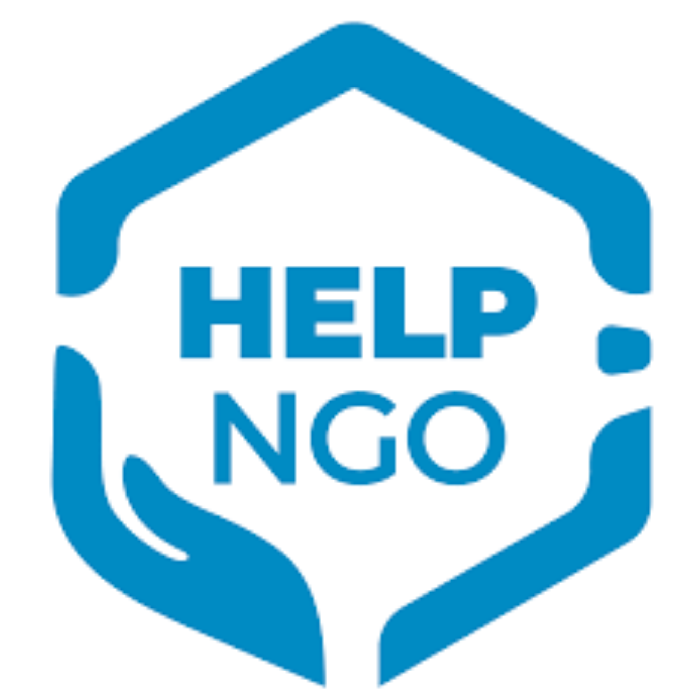

# SigmaPulse — Clustering de pays pour l'aide humanitaire

<p align="center">
  
  &nbsp;&nbsp;&nbsp;&nbsp;
  
</p>

---

## 🌍 Dashboard interactif

> Accédez à l'application de visualisation des clusters :
>
> **[Lancer le Dashboard SigmaPulse](https://sigmapulse-ensae.onrender.com/)**

---

## Vue d'ensemble

SigmaPulse est un projet académique de Machine Learning consacré à l'optimisation de l'allocation de l'aide humanitaire à travers une approche analytique, explicable et orientée données.

Dans un contexte mondial marqué par l'intensification des crises humanitaires et la limitation des ressources financières, le projet vise à construire un cadre d'analyse robuste permettant d'identifier des groupes de pays présentant des vulnérabilités similaires sur les plans économique, sanitaire, social et sécuritaire.

Le projet combine :

- Des indicateurs macro-économiques
- Des indicateurs de santé publique
- Des indicateurs de vulnérabilité sociale
- Des indicateurs de fragilité étatique et sécuritaire
- Des techniques de Machine Learning non supervisé

L'objectif est de proposer une stratégie d'allocation des ressources humanitaires plus transparente, cohérente et fondée sur les données.

---

## Vision du projet

> *« L'aide humanitaire de demain ne peut plus reposer uniquement sur des intuitions géopolitiques. Avec des ressources limitées, chaque décision d'allocation compte. SigmaPulse mobilise la puissance du Machine Learning pour transformer des indicateurs macro-économiques et humanitaires complexes en une stratégie d'allocation rigoureuse, éthique et data-driven. »*
>
> — Équipe SigmaPulse

---

## Stack technique

### Langages
- Python 3.11+
- SQL
- Markdown

### Data Science & Machine Learning
- pandas, numpy, scikit-learn, scipy, statsmodels, imbalanced-learn

### Visualisation
- matplotlib, seaborn, plotly

### Environnement de développement
- Jupyter Notebook, Google Colab, VS Code

### Versioning
- Git, GitHub

---

## Architecture du dépôt

```text
SigmaPulse/
│
├── images/
│   ├── logo_sigmapulse.png
│   └── logo_help.png
│
├── data/
│   ├── raw/                   # Jeux de données bruts
│   ├── processed/                   
│   └── final/             # Bases finales prêtes pour le ML
│
├── notebooks/
│   ├── P0_init-merge.ipynb
│   ├── P1_EDA_main.ipynb
│   ├── P1_EDA_enriched.ipynb
│   ├── P2_modeling.ipynb
│   └── P5_interpretation.ipynb
│
├── outputs/
│   ├── figures/
│   ├── tables/
│   ├── reports/
│   └── datasets_agreges/
│
├── src/
│   ├── preprocessing/
│   ├── feature_engineering/
│   ├── modeling/
│   ├── visualization/
│   └── utils/
│
├── docs/
│   ├── methodology/
│   ├── references/
│   └── presentations/
│
├── requirements.txt
├── README.md
├── .gitignore
└── LICENSE
```

---

## Sources de données

Le projet mobilise plusieurs bases internationales relatives au développement, à la santé publique et à la fragilité des États.

| Source | Organisme | Usage |
|---|---|---|
| Country-data | Kaggle / HELP International | Base principale (167 pays) |
| World Development Indicators | Banque Mondiale | Variables macroéconomiques et sanitaires |
| Global Health Observatory | OMS / WHO | Mortalité, VIH, vaccination |
| Fragile States Index 2015 | Fund for Peace | Indicateurs de fragilité et sécurité |

### Data augmentation

La base initiale fournie via Kaggle a été enrichie par une phase de data augmentation multi-sources afin d'améliorer la couverture géographique, la diversité des indicateurs, et la robustesse du clustering. L'année de référence retenue pour la fusion est **2014**, sélectionnée selon le critère de complétude maximale calculé variable par variable.

---

## Pipeline Machine Learning

### 1. Fusion et harmonisation
Standardisation des noms de pays, harmonisation des codes ISO, fusion multi-sources, alignement des millésimes.

### 2. Nettoyage et prétraitement
Gestion des valeurs manquantes (imputation KNN), transformations logarithmiques des variables asymétriques (|skewness| > 1), normalisation RobustScaler.

### 3. Analyse exploratoire (EDA)
Distributions, matrices de corrélation, détection des valeurs extrêmes, profilage des pays.

### 4. Clustering
- K-Means (algorithme retenu — k=3 sur dataset classique, k=4 sur dataset enrichi)
- Classification Ascendante Hiérarchique (validation par dendrogramme Ward)
- DBSCAN (diagnostic de densité)
- ACP / PCA pour la réduction dimensionnelle et la visualisation

### 5. Interprétation
Profilage des clusters, cartographie des vulnérabilités, recommandations stratégiques d'allocation.

---

## Variables retenues

### Santé
- Espérance de vie, mortalité infantile, mortalité maternelle
- Prévalence du VIH, couverture vaccinale DPT
- Médecins pour 1 000 habitants

### Économie
- PIB par habitant (gdpp), inflation

### Vulnérabilité sociale
- Sous-alimentation, scolarisation

### Sécurité et fragilité (Fragile States Index)
- Security apparatus, Group grievance
- Refugees and IDPs, External intervention

---

## Notes méthodologiques

### Gestion des valeurs aberrantes
Certaines variables présentent des valeurs extrêmes visibles à travers les boxplots. Ces valeurs n'ont volontairement pas été imputées ni supprimées : elles traduisent des écarts réels de développement entre pays. Dans le cadre d'une analyse humanitaire mondiale, ces différences structurelles constituent précisément l'information que le modèle cherche à capturer.

### Pourquoi le clustering et non la classification ?
Aucune taxonomie universelle des pays selon leur niveau de besoin humanitaire n'existe à ce jour. Créer des étiquettes manuellement introduirait un biais normatif inacceptable. Le clustering non supervisé laisse les données définir elles-mêmes les groupes, produisant des résultats objectifs et défendables.

---

## Équipe projet

| Membre | GitHub |
|---|---|
| Awa Diaw | [@awa-d](https://github.com/awa-d) |
| Moussa Dieme | [@Mafieuu](https://github.com/Mafieuu) |
| Ndeye Ramatoulaye Ndoye Fall | [@Vimdie](https://github.com/Vimdie) |
| Hildegarde Edima Biyenda | [@HildaEDIMA](https://github.com/HildaEDIMA) |

**Encadrante académique** : [Mously Diaw](https://github.com/mouslydiaw) — Senior Machine Learning & Data Science Supervisor

---

## Reproductibilité

```bash
# Cloner le dépôt
git clone https://github.com/Vimdie/clustering_countries.git

# Installer les dépendances
pip install -r requirements.txt
```

Exécuter les notebooks dans l'ordre : P0 → P1_main puis P1_enriched → P2 → P3, via Jupyter Notebook, VS Code ou Google Colab.

---

## Perspectives futures

- Intégration d'indicateurs humanitaires en temps réel
- Prévision temporelle des risques de dégradation
- Explainable AI (XAI) pour l'interprétabilité des modèles
- Cartographie géospatiale avancée des vulnérabilités
- Système dynamique d'allocation de ressources

---

## Licence

Ce dépôt s'inscrit dans le cadre d'un projet académique. Son utilisation est autorisée à des fins éducatives et de recherche.

---

*SigmaPulse — Calculated compassion, where Data Science meets human dignity.*
```
